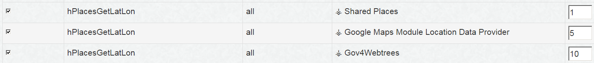
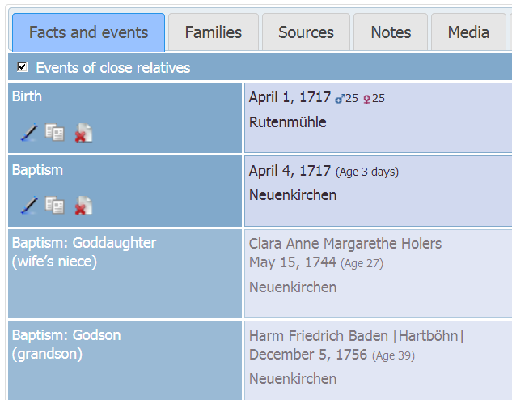

# Webtrees Custom Module: ⚶ Facts and Events

This [webtrees](https://www.webtrees.net/) custom module provides an extended 'Facts and Events' tab, with hooks for other custom modules.
The project’s website is [cissee.de](https://cissee.de).

This is a webtrees 1.x module - It cannot be used with webtrees 2.x. For its webtrees 2.x counterpart, see [here](https://github.com/vesta-webtrees-2-custom-modules/vesta_personal_facts).

## Contents

* [Features](#features)
* [Download](#download)
* [Installation](#installation)
* [License](#license)

### Features<a name="features"/>

Mainly intended as a base for other custom modules. Some features are available independently:

* Links to external maps (Google, Bing, OpenStreetMap) are configurable via module administration.

* The respective location data is obtained directly from the gedcom, and may also be provided by other custom modules via the 'hPlacesGetLatLon' hook. 

* If you have collected location data via the Google Maps module, simply activate the 'Google Maps Module Location Data Provider' custom module to make this data available.

* If you have multiple custom modules providing location data, you can change their priority via the Hooks module configuration:

* Facts and events of inverse associates are also configurable. For these facts and events, the inverse associations and relationships are also displayed:

* Fixes [Webtrees issue #1192](https://github.com/fisharebest/webtrees/issues/1192).

### Download<a name="download"/>

* Current version: 1.7.16.1
* Based on and tested with webtrees 1.7.16, may also work with older 1.7.x versions. Cannot be used with webtrees 2.x.
* Requires the Hooks module ('hooks_repackaged', or the original Hooks module via webtrees-geneajaubart).
* Requires the 'vesta_common_lib' module.
* Download the zipped module, including all related modules, [here](https://cissee.de/vesta.latest.zip).
* Support, suggestions, feature requests: <ric@richard-cissee.de>
* Issues also via <https://github.com/ric2016/personal_facts_with_hooks/issues>

### Installation<a name="installation"/>

* Unzip the files and copy them to the modules_v3 folder of your webtrees installation. All related modules are included in the zip file. It's safe to overwrite the respective directories if they already exist (they are bundled with other custom modules as well), as long as other custom models using these dependencies are also upgraded to their respective latest versions.
* Enable the extended 'Facts and Events' module via Control Panel -> Modules -> Module Administration -> Facts and Events.
* Enable the Hooks module via Control Panel -> Modules -> Module Administration -> Hooks. Make sure all hooks are selected (in the preferences of the Hooks module).				
* Configure the visibility of the old and the extended 'Facts and Events' tab via Control Panel -> Modules -> Tabs (they both appear as 'Facts and Events' here - usually, you'll want to use only one of them. You may just disable the old 'Facts and Events' module altogether).

### License<a name="license"/>

* **personal_facts_with_hooks: a webtrees custom module**
* Copyright (C) 2016 to 2020 Richard Cissée
* Derived from **webtrees** - Copyright (C) 2010 to 2016  webtrees development team.
* Derived from **webtrees-geneajaubart** - Copyright (C) 2009 to 2016  Jonathan Jaubart.
* French translations provided by Ghezibde.

This program is free software: you can redistribute it and/or modify
it under the terms of the GNU General Public License as published by
the Free Software Foundation, either version 3 of the License, or
(at your option) any later version.

This program is distributed in the hope that it will be useful,
but WITHOUT ANY WARRANTY; without even the implied warranty of
MERCHANTABILITY or FITNESS FOR A PARTICULAR PURPOSE. See the
GNU General Public License for more details.

You should have received a copy of the GNU General Public License
along with this program. If not, see <http://www.gnu.org/licenses/>.
